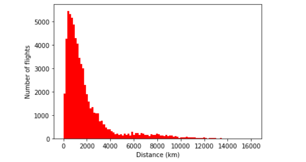

# Lab5 - Analyzing Airport data

In this project, we analyze the airport data on Google Colab using Python. We calculate the distances of some flights and create a histogram to compare the number of flights and distances. This exercise uses the data from OpenFlight Project. There are various challenges throughout the exercise. The first challenge is to open the .dat file in Colab and print the names of all the airports for a country. The second challenge is to read the airport database, third challenge is to calculate the route distances,  and fourth is to create a histogram to represent data. 

